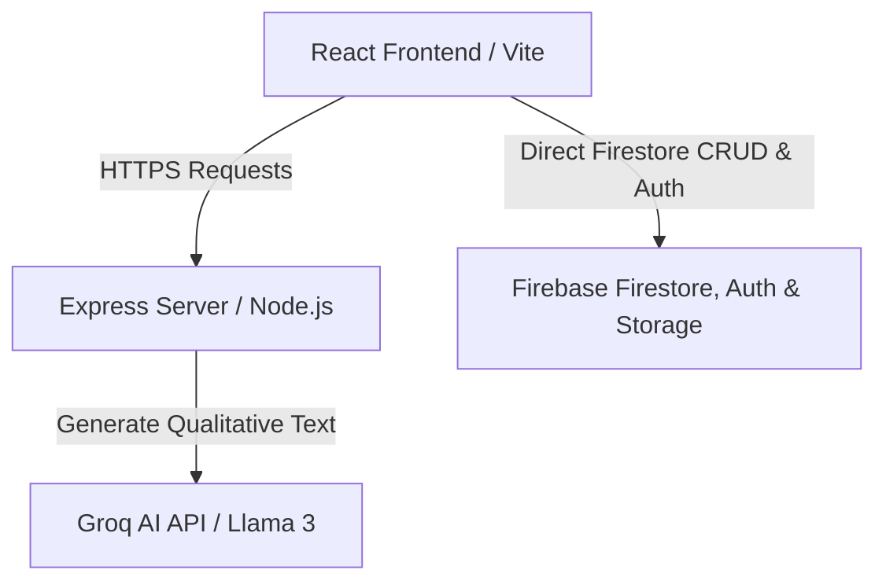

# Product Requirements & System Architecture Document
## Project: Career Guidance & Psychometric Assessment Platform (Bhagwan Pandekar - Career Counsellor)

---

## 1. Document Control & Metadata
*   **Version:** 1.2.0
*   **Date:** June 13, 2026
*   **Status:** Active / Firebase CMS System Reference
*   **Target Domain:** Career Counselling, Student Psychometric Profiling, Lead Generation, Content Management

---

## 2. Product Vision & Overview
The **Career Guidance & Psychometric Assessment Platform** is a custom web solution designed for **Bhagwan Pandekar**, a professional career counselor. The system serves three core purposes:
1.  **Public Branding & Lead Capture:** Highlighting counselling packages, articles, testimonials, and FAQs, alongside contact and booking widgets.
2.  **Psychometric Testing Engine:** A 96-question interactive Likert-scale wizard assessing RIASEC interests, Big Five personality traits, and core skills.
3.  **Qualitative AI Interpretation:** Merges the quantitative scores with qualitative descriptions generated securely via the Groq API (using the Llama 3 model) to show a detailed analysis directly on the web interface.
4.  **Counselor Administration Panels:** Allows the counselor to login and monitor lead requests, manage site alerts, write blog posts, and upload downloadable resources directly using a client-side CMS.

---

## 3. System Architecture & Tech Stack



### Frontend Stack
*   **Core:** React 19, TypeScript, Vite.
*   **Styling:** Tailwind CSS loaded dynamically via CDN in `index.html` with theme extensions (brand colors, fonts, custom animations) + custom Vanilla CSS utilities.
*   **Graphics & Visualization:** `recharts` for interest/personality progression bar charts. `lucide-react` for iconography.
*   **Email Engine:** Direct integration with **EmailJS** to send report summaries and booking confirmations directly from the browser.

### Backend Stack
*   **Core:** Express.js (Node.js) using modular routing.
*   **Security:** `helmet` for secure HTTP headers, `cors` to allow cross-origin calls, and `express-rate-limit` to restrict API endpoints (100 requests / 15 mins overall, 20 requests / hour for report generation).

---

## 4. Database & Storage Architecture

The application implements a **Firebase-First Database Strategy** to optimize for client-side CMS responsiveness and simple hosting setups.

### Firebase Firestore & Storage
Used directly by the React client for CMS and lead booking records.

#### **Firestore Collections**
1.  **`blogs`**: Manage articles written by the counselor.
    *   Fields: `id`, `title`, `excerpt`, `content`, `author`, `date`, `imageUrl`, `category`.
2.  **`notifications`**: Site-wide urgent banner broadcasts.
    *   Fields: `id`, `title`, `message`, `type` (`urgent` | `info`), `date`, `active`, `link` (optional).
3.  **`resources`**: Downloadable guides.
    *   Fields: `id`, `title`, `description`, `fileType`, `downloadUrl`, `fileSize`.
4.  **`inquiries`**: Submissions from the contact footer form.
    *   Fields: `id`, `name`, `phone`, `message`, `date`, `isRead`.
5.  **`registrations`**: Booking wizard bookings.
    *   Fields: `id`, `name`, `email`, `phone`, `dob`, `age`, `education`, `address`, `serviceType` (`counselling` | `assessment`), `amount`, `date`, `paymentStatus`.

---

## 5. Psychometric Scoring & Algorithms

### 5.1. Likert Scale Input
The 96-question assessment collects ratings from **1 (Strongly Disagree)** to **5 (Strongly Agree)**.

### 5.2. Composite Scoring Calculations
Calculated client-side in [scoringEngine.ts](file:///d:/Pradyumna/GitHub/Career-Guidance-Website/services/scoringEngine.ts):

*   **RIASEC Percentage (0-100%):** Sums category-specific questions and maps to a percentage scale.
*   **Big Five Personality Metrics (0-100%):** Groups traits (Openness, Conscientiousness, Extraversion, Agreeableness, Emotional Stability) with standard reverse-scoring calculations applied where appropriate.
*   **Skills Evaluation (0-100%):** Assesses aptitude areas (Logical, Numerical, Verbal, Spatial, Leadership, Creative, Technical, Organising).
*   **Holland Code:** Formed from the letters corresponding to the **Top 3 RIASEC interests** sorted in descending order (e.g. Social, Enterprising, Conventional $\rightarrow$ `"SEC"`).
*   **Stanine Score (1 to 9):**
    A composite index normalized to a 9-point scale using the weighted distribution:
    $$\text{Stanine} = (0.4 \times \text{Skills Mean}) + (0.3 \times \text{RIASEC Mean}) + (0.3 \times \text{Personality Mean})$$
    The final percentage is graded into boundaries:
    *   $1-9$ mapping corresponds to:
        *   $1$ ($\le 10\%$), $2$ ($11-22\%$), $3$ ($23-40\%$), $4$ ($41-59\%$), $5$ ($60-72\%$), $6$ ($73-82\%$), $7$ ($83-89\%$), $8$ ($90-95\%$), $9$ ($\ge 96\%$).

### 5.3. Assessment Reliability Index
Determined during assessment completion:
*   **Speed Check:** Calculates time elapsed. If the average time per question is $< 1.5\text{s}$, the reliability score is severely penalized.
*   **Pattern Repetition Check:** Analyzes standard deviation of answers. Continuous selection of identical scores (e.g., choosing `3` for 40 questions straight) reduces reliability.
*   **Reliability Levels**:
    *   $\ge 70$: `High`
    *   $40 - 69$: `Medium`
    *   $< 40$: `Low` (triggers a red warning banner on the Results Screen).

---

## 6. External Integrations

### 6.1. Groq AI Service (`groqService.js`)
*   **Model:** `llama-3.3-70b-versatile`
*   **Role:** Analyzes the quantitative score profile and output matches, returning a strictly qualitative text narrative block.
*   **Constraint:** Structured JSON response format. The AI is strictly forbidden from printing any numerical scores, RIASEC rankings, or confidence percentages to avoid conflict with the mathematical calculations.
*   **API Prompts:** Inputs RIASEC, Big Five, skills, and top recommended career lists and outputs:
    ```json
    {
      "strengths": ["string", "string", "string"],
      "developmentAreas": ["string", "string"],
      "learningStyle": "string",
      "academicRecommendations": ["string", "string", "string"],
      "careerFitNarrative": "string",
      "conclusion": "string"
    }
    ```

### 6.2. EmailJS Integration (`services/email.ts`)
*   **Service ID:** `service_g8zyevq`
*   **Registration Template ID:** `template_3t7oi1o`
    *   Variables: `{{to_name}}`, `{{to_email}}`, `{{service_type}}`, `{{registration_date}}`, `{{message}}`
*   **Report Delivery Template ID:** `template_cyx10oq`
    *   Variables: `{{to_name}}`, `{{to_email}}`, `{{profile_summary}}`, `{{strengths}}`, `{{growth_areas}}`, `{{learning_style}}`, `{{work_style}}`, `{{career_recommendations}}`, `{{top_careers}}`
*   **Public Key:** `9xz2Cudlad-sH32df`

---

## 7. API Routing & Endpoints Specification

### 7.1. Report Routes (`/api`)
*   `POST /generate-report`: Sends profile scores and career matches to Groq AI to fetch the JSON interpretation block.

---

## 8. Directory & File Reference Map

```
Career-Guidance-Website/
│
├── App.tsx                     # Main React application route and state coordinator
├── index.tsx                   # React root mount script
├── index.html                  # Core HTML file containing Tailwind CDN configuration & utility styles
├── package.json                # Dependencies and run scripts
├── tsconfig.json               # TypeScript configuration
├── vercel.json                 # Deploy mappings
├── vite.config.ts              # Vite configuration
│
├── components/                 # React UI Components
│   ├── AICareerMatch.tsx       # Landing page section showing assessment teaser
│   ├── About.tsx               # landing page Section highlighting counselor background
│   ├── AdminDashboard.tsx      # Admin console for direct Firebase Firestore CMS management
│   ├── ArticleView.tsx         # Detailed blog article reader
│   ├── AssessmentLogin.tsx     # Student registration form prior to starting the assessment
│   ├── AssessmentScreen.tsx    # Multi-step 96-question psychometric wizard
│   ├── BackgroundElements.tsx  # Dynamic floating CSS bubble layouts
│   ├── BlogSection.tsx         # Landing page grid showing current articles
│   ├── BookingWizard.tsx       # Flow to register for counselor packages & schedule bookings
│   ├── CareerFlowData.ts       # Static dataset maps for CareerPathExplorer
│   ├── CareerPathExplorer.tsx  # Interactive career navigation dashboard
│   ├── Contact.tsx             # Footer inquiry submission form
│   ├── CounterAnimation.tsx    # Animating digits for statistics cards
│   ├── Downloads.tsx           # Page listing downloadable reference documents
│   ├── ErrorBoundary.tsx       # Fallback renderer for React render failures
│   ├── FAQ.tsx                 # Accordion-style general information container
│   ├── Hero.tsx                # Main banner section
│   ├── LoginScreen.tsx         # Firebase auth-based login window for the CMS admin dashboard
│   ├── Navbar.tsx              # Top navigation bar
│   ├── NotificationSystem.tsx  # Top alert banners for site-wide communications
│   ├── ResourceData.ts         # Diagnostic mappings for careers and entrance exams
│   ├── Resources.tsx           # Educational pathways explorer view
│   ├── ResultsScreen.tsx       # Detailed post-assessment score visualization and email trigger
│   ├── SectionHeading.tsx      # Unified visual component for title headers
│   ├── Services.tsx            # Counseling packages price cards
│   └── Testimonials.tsx        # Customer review quotes container
│
├── services/                   # Business Logic & Local Engines
│   ├── api.ts                  # Direct client-to-Firestore CRUD service integrations
│   ├── assessmentStorage.ts    # LocalStorage parser for saving unfinished test progress
│   ├── auth.ts                 # Firebase authentication helper
│   ├── careerMatching.ts       # Algorithm to calculate best career fits from RIASEC, personality & skills
│   ├── email.ts                # EmailJS browser client integrations
│   ├── scoringEngine.ts        # Calculations engine for RIASEC, Big 5, and Stanines
│   └── storage.ts              # File uploads to Firebase Storage
│
├── translations/               # Localization
│   ├── en.ts                   # English translation keys
│   ├── hi.ts                   # Hindi translation keys
│   ├── mr.ts                   # Marathi translation keys
│   └── index.tsx               # Context provider mapping language selector values
│
├── lib/                        # Shared client utility functions
│   ├── aiReport.ts             # Calls the backend /api/generate-report to prompt Groq
│   ├── analytics.ts            # Local metrics event triggers
│   └── firebase.ts             # Firebase config initializing auth, storage, and firestore
│
├── data/                       # Local JSON datasets
│   ├── career_assessment.json  # 96 questions mapped to RIASEC/Personality/Skills indexes
│   └── career_database.json    # Extensive mapping of careers, categories, descriptions, and ideal profiles
│
└── server/                     # Backend Node.js Environment
    ├── server.js               # Central server loader, rate-limit config, and routes mount
    ├── middleware/
    │   └── errorHandler.js     # Global HTTP error handler
    └── routes/
        └── reportRoutes.js     # Triggers Groq completions
```
