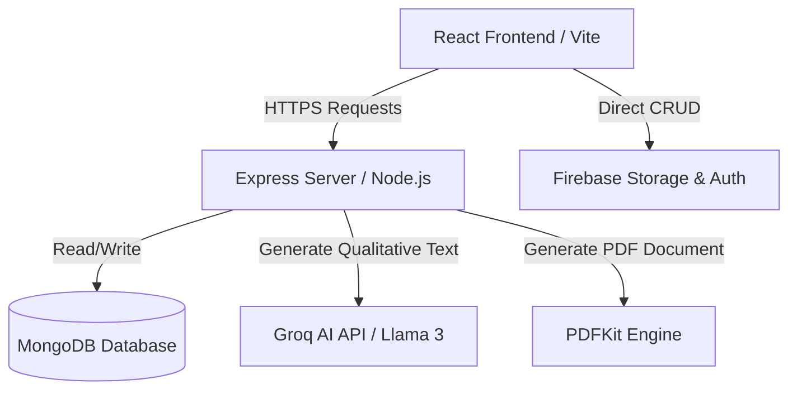

# Product Requirements Document (PRD)
## Project Name: Career Guidance & Psychometric Assessment Platform (Bhagwan Pandekar - Career Counsellor)

---

## 1. Document Control & Metadata
*   **Version:** 1.0.0
*   **Date:** June 1, 2026
*   **Status:** Draft / Approved
*   **Author:** AI Coding Assistant (Antigravity)
*   **Target Domain:** Career Guidance and Counseling

---

## 2. Product Overview & Vision
The **Career Guidance & Psychometric Assessment Platform** is a web-based solution custom-built for **Bhagwan Pandekar**, a professional career counselor. The system acts as a dual-purpose platform:
1.  **Public Branding & Marketing:** Serves as a digital portal highlighting the counselor's services, articles, customer testimonials, and FAQs.
2.  **Psychometric Testing & Diagnostic Engine:** Offers candidates an interactive psychometric assessment based on standardized methodologies (RIASEC, Big Five, and Aptitude/Skills), followed by a professional, downloadable 10-page analysis report.
3.  **Lead Generation & Client Management:** Enables booking requests, contact queries, and a centralized admin panel to manage files, blog posts, notifications, and client assessments.

The core vision is to guide school and college students, as well as job seekers, towards the right careers by blending statistical scoring with qualitative AI-driven recommendations.

---

## 3. Core Objectives & Key Performance Indicators (KPIs)
*   **Assessment Completion Rate:** Achieve >85% assessment completion once started (mitigated by autosave progress and intuitive multi-step wizard UI).
*   **Lead Conversion:** Enable users to request professional consultation bookings directly from their assessment results or the home page.
*   **Report Generation Reliability:** Zero backend crashes when compiling and serving highly detailed, multi-page PDFs.
*   **Content Freshness:** Empower admin users to dynamically post new articles, update downloadable resources, and create homepage banner alerts.

---

## 4. User Personas
### A. The Student / Candidate
*   **Needs:** Wants to understand their true career fit, strengths, and areas of growth. Needs a clean, engaging interface that does not feel intimidating.
*   **Actions:** Registers with personal and academic details, takes the 96-question assessment, reviews interactive charts of their personality and skills, and downloads their custom 10-page report.

### B. The Parent
*   **Needs:** Wants scientific backing for their child's career trajectory. Wants a reliable, readable document summarizing the assessment results and actions.
*   **Actions:** Reviews the candidate's dashboard, reads/downloads the psychometric report, and requests counseling sessions via the Booking Wizard.

### C. The Admin (Bhagwan Pandekar / Counselor)
*   **Needs:** Wants to see who took the test, view their detailed scores, manage website content (blogs, resources, banner alerts), and receive booking requests.
*   **Actions:** Logs into a secure admin panel, updates resources/articles, views submissions, and monitors student records.

---

## 5. Functional Requirements & Feature Breakdown

### 5.1. Public Landing Page & Frontend Navigation
*   **Hero Section:** High-impact intro, clear value proposition, and a CTA to start the Career Assessment.
*   **Services Section:** Highlights structured packages offered by the counselor with an integrated "Book Now" CTA.
*   **Testimonials & FAQ:** Clean accordion components and carousel cards displaying successful outcomes and frequently asked questions.
*   **Resource Library & Blog:** Displays blogs and PDF resources stored dynamically in Firebase.
*   **Downloads Section:** User can directly download guides or sample reports.
*   **Contact & Footer:** Contact forms that submit inquiries to the admin dashboard, and links to administrative entry points.

### 5.2. Candidate Registration & Auth (Assessment Gateway)
*   **Candidate Form Details:**
    *   *Required:* Full Name, Date of Birth (DOB), Gender, Mobile Number, Email, School/College, Class/Year, City.
    *   *Optional:* Academic Stream, Parent Name, Parent Mobile.
*   **Persisted Session:** Relies on local storage or Firebase session parameters. Allows returning students to view their dashboard containing historic assessment attempts.

### 5.3. The Psychometric Assessment Engine
*   **Assessment Interface:** Divided into logical sections representing Holland Codes, Big Five, and Skills/Aptitudes.
*   **Question Matrix:** 96 interactive items scored on a Likert scale (1 to 5).
*   **Autosave & Navigation:** Tracks progress continuously, enabling students to pause and resume.
*   **Local Calculation Engine (`ScoringEngine`):**
    *   Calculates **RIASEC** percentages (Realistic, Investigative, Artistic, Social, Enterprising, Conventional).
    *   Calculates **Big Five** personality metrics (Openness, Conscientiousness, Extraversion, Agreeableness, Neuroticism).
    *   Calculates **Core Skills** percentiles.
    *   Computes a combined **Stanine Score** (1 to 9 scale) with the following weights: `40% Skills + 30% RIASEC + 30% Personality`.
    *   Finds the **Holland Code** based on the Top 3 RIASEC traits.

### 5.4. Backend Scoring & AI Integration
*   **MongoDB Schema:** Stores candidate metadata, raw answers, score metrics, and the generated AI report structure.
*   **Groq AI Service (`groqService.js`):**
    *   Uses Llama 3 model (via Groq API) to generate highly specific qualitative narrative blocks.
    *   **Strict AI Constraint:** AI *only* outputs qualitative text: `Strengths`, `Development Areas`, `Learning Style`, `Academic Recommendations`, `Career Fit Narrative`, and `Final Conclusion`.
    *   AI is strictly forbidden from outputting numerical scores, RIASEC rankings, or reliability levels to prevent hallucinated stats from conflicting with the mathematical model.

### 5.5. Professional PDF Generation Engine (`pdfService.js`)
Generates a professional 10-page A4 PDF containing the candidate's psychometric profile.
*   **Page Layout:**
    *   *Page 1:* Modern cover page with title, candidate name, date of assessment.
    *   *Page 2:* Candidate profile card + detailed assessment context.
    *   *Page 3:* Executive Summary highlighting the Holland Code and Stanine Score card.
    *   *Page 4:* RIASEC profile (horizontal progress bars).
    *   *Page 5:* Big Five Personality details.
    *   *Page 6:* Skills & Aptitudes summary table.
    *   *Page 7:* Stanine score distribution explanation.
    *   *Page 8:* Career recommendations (Top matches, description, AI Career Fit Narrative).
    *   *Page 9:* Strategic Development Plan (AI-generated strengths, learning styles, development areas).
    *   *Page 10:* Counselor summary, signature blocks, contact details.
*   **Asset Management:** Local Inter font files (`Inter-Regular.ttf`, `Inter-SemiBold.ttf`, `Inter-Bold.ttf`) are compiled with PDFKit to ensure text renders identically across all OS and browser types.

### 5.6. Admin Control Panel
*   **Authentication:** JWT-based login mechanism protecting server-side routes.
*   **Dashboard Features:**
    *   **Blogs Management:** Create, update, or delete blog posts (Firebase backend).
    *   **Resources Management:** Upload downloadable documents.
    *   **Notifications:** Broadcast site-wide notification banners.
    *   **Inquiries Tracker:** Read user requests submitted from the contact form or booking wizard.
    *   **Assessment Log Viewer:** Admin can review all student registrations and scores.

---

## 6. Technical Stack & Architecture

*   **Frontend:** React (v19), TypeScript, Vite, Recharts (for results visualization), Tailwind CSS (for layout styling), Lucide-react (icons).
*   **Backend:** Express.js (Node.js) using modular routes (`adminRoutes`, `analyticsRoutes`, `assessmentRoutes`, `reportRoutes`).
*   **Database:** MongoDB via Mongoose ORM for assessment data. Firebase Firestore/Storage for dynamic assets (blogs, resources).
*   **External Integrations:**
    *   **Groq SDK / Gemini SDK** for qualitative analysis.
    *   **EmailJS / NodeMailer** for email dispatch.

---

## 7. Non-Functional & Security Requirements
*   **Rate Limiting:** Implemented on all `/api` endpoints (max 100 requests per 15 mins) and `/api/generate-report` (max 20 requests per hour per IP) to prevent denial of service and API cost overflows.
*   **Data Protection:** Helmet middleware loaded to define secure HTTP headers. Express request parser restricted to `1mb` payloads to avoid memory exhaustion attacks.
*   **Typography Isolation:** Pure PDFKit embedded fonts (Inter) registered from the server path. Eliminates dynamic external network requests during PDF assembly.
*   **SEO Optimization:** Dynamic page-level document titles updated on-the-fly according to active router views.
